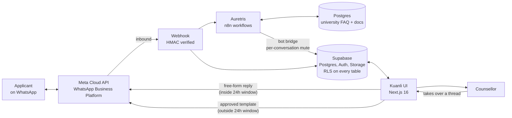

# Kuanli: WhatsApp CRM for student admissions

> A self-hosted CRM built on the official WhatsApp Business API, for
> counselling teams who run their entire admissions funnel over chat.
> Shared inbox, per-university pipelines, application and document
> tracking, and an automated re-engagement engine.

[](./LICENSE)
[](https://nextjs.org)
[](https://react.dev)
[](https://www.typescriptlang.org)
[](https://supabase.com)

Most CRMs assume email. Admissions counselling does not work that way.
The entire relationship, from first enquiry to submitted documents,
happens in WhatsApp. Kuanli is built around that: the conversation is
the record, and the pipeline, application state, and document checklist
all hang off it.

This runs in production against real applicant traffic.

## Architecture



The **24-hour service window** is the constraint that shapes everything above it. Inside 24 hours of
the applicant's last message you may send free-form replies. Outside it, only a Meta-approved
template will deliver. The bot bridge carries a per-conversation mute, so a counsellor can take over
a thread mid-conversation and the bot stays out of it.

## What it does

**Shared inbox.** Multiple counsellors working one WhatsApp number,
with per-conversation assignment, status, internal notes, and reply
quoting. Multiple business numbers per account are supported, and each
contact keeps a separate thread per number.

**Pipelines.** Kanban deal boards with a distinct pipeline per
university, so an applicant to one institution moves through that
institution's stages without polluting another's funnel. Board, funnel,
and activity views.

**Lead queue.** Segmented work queue so counsellors always have a
defined next action instead of scrolling the inbox.

**Applications and documents.** Collects marksheets and ID documents
over WhatsApp against a per-university required-document checklist,
tracks each one's verification state, and archives verified files into
a private, account-scoped storage bucket rather than leaving them to
expire in Meta's media store.

**Follow-up engine.** A configurable re-engagement ladder that nudges
silent leads on a delay schedule. Rungs fire at most once per silence
spell, with a spacing guard and a per-run cap. Over-messaging degrades
a number's quality rating with Meta, which throttles every send
including human replies, so the limits are deliberate.

**Broadcasts.** Meta-approved templates with per-recipient variable
substitution, plus delivery and read tracking.

**Automations and flows.** A visual builder with triggers on inbound
messages, keywords, new contacts, tag changes, and schedules;
conditional branches, waits, tagging, and webhooks.

**Reporting.** Funnel analytics by stage, response times, daily volume,
and a scheduled end-of-day summary mailer.

**Bot bridge.** A documented seam for an external AI agent to answer
inbound messages and write back into the CRM, with a per-conversation
mute so a human can take over a thread mid-conversation and the bot
stays out of it.

**Team accounts.** Invite by link, roles (owner / admin / agent /
viewer), ownership transfer, and account-scoped row-level security on
every table.

## Stack

- **App:** Next.js 16 (App Router), React 19, TypeScript (strict), Tailwind v4
- **Data:** Supabase: Postgres, Auth, Storage, RLS on every table
- **WhatsApp:** Meta Cloud API (official WhatsApp Business API)
- **Tests:** Vitest, colocated with source

## Operating on the WhatsApp Cloud API

The code is the easy half. This is the half that breaks in production, and it is mostly not
documented anywhere useful.

**Number quality tiers.** Meta assigns every business number a quality rating and a messaging
limit. Poorly targeted or over-frequent sending drops the rating, which lowers the daily limit. The
throttle applies to **every** send from that number, including a human counsellor's replies, not
only automated ones. This is why the follow-up engine ships with a spacing guard and a per-run cap
rather than a simple retry loop. Recovering a dropped tier takes days of clean sending; there is no
switch to flip.

**Template approval.** Any message outside the 24-hour window must use a template Meta has
approved. Approvals commonly fail on:

- Category mismatch, most often promotional content submitted under a utility category
- Placeholder formatting, including a template that opens or closes on a variable
- Variable counts that do not match the sample values provided

Submit templates well before you need them. A rejection blocks the entire re-engagement path, not
just one message.

**The 24-hour service window.** Free-form replies are only permitted within 24 hours of the
applicant's last inbound message. A flow designed without this constraint appears to work in testing
and fails silently in production, and the failure looks like a bug in the bot rather than a platform
rule. Kuanli tracks the window per conversation and switches to templates when it closes.

**Per-message billing.** Meta moved from per-conversation to per-message pricing in **July 2025**.
Any cost model built on the older per-conversation basis will quote the wrong number. Verify current
rates against Meta's pricing documentation before relying on them; this has changed once already.

**Delivery and retries.** Webhooks are HMAC-verified and can arrive out of order or more than once,
so handlers must be idempotent. A failed send is not always retryable: a template rejection and a
rate limit need different handling, and blind retries on the former burn quality rating.

## Running it

```bash
git clone https://github.com/Prthm-G/Kuanli.git
cd Kuanli
npm install
cp .env.local.example .env.local   # Supabase + Meta credentials
npm run dev
```

Open <http://localhost:3000>; you'll land on `/login`.

Apply the SQL in `supabase/migrations/` against your Supabase project in
filename order before first run. Migrations are numbered and each header
documents its rationale and rollback.

### Getting the WhatsApp side working

The steps above assume you already hold Supabase and Meta credentials. If you do not, this is the
missing half, and it is where most of the time actually goes.

1. **Meta app and WhatsApp product.** Create a Meta app at
   [developers.facebook.com](https://developers.facebook.com), add the WhatsApp product, and note
   the app ID and app secret.
2. **A business number.** Either register a new test number inside WhatsApp Manager or migrate an
   existing one. A number already in use by the WhatsApp consumer or Business app must be deleted
   from that app first, and that is irreversible for its chat history.
3. **A system user token.** Create a system user in Business Manager, assign it the WhatsApp
   Business Account asset, and generate a permanent token. A short-lived user token will work in
   testing and then expire in production, which is a bad way to find out.
4. **Webhook.** Point Meta at `https://<your-host>/api/webhook`, subscribe to the `messages` field,
   and set a verify token matching your `.env.local`. Meta requires a publicly reachable HTTPS
   endpoint; a tunnel is fine for development.
5. **First template.** Submit one utility-category template and wait for approval before you rely
   on it. Read the operating notes above first; the common rejection reasons are listed there.
6. **Send a test message** to the business number and confirm it lands in the inbox.

Budget roughly 30 minutes for steps 1, 3, 4 and 6. Steps 2 and 5 depend on Meta's review queue and
are not under your control.

```bash
npm run test       # vitest
npm run typecheck  # tsc --noEmit
npm run lint       # eslint
npm run build      # production build
```

## Security

RLS is enforced on every table, WhatsApp tokens are encrypted at rest
(AES-256-GCM), webhooks are HMAC-verified, and privilege columns on
`profiles` are guarded at the database layer so membership can only
change through supervised, `SECURITY DEFINER` RPCs.

Found a vulnerability? Please follow [`.github/SECURITY.md`](./.github/SECURITY.md)
and report it privately rather than opening a public issue.

## Credits

Kuanli began as a fork of [ArnasDon/wacrm](https://github.com/ArnasDon/wacrm),
an MIT-licensed self-hostable WhatsApp CRM template by Arnas Donauskas,
and has since diverged substantially. The admissions domain model
(university pipelines, applications, documents, lead queue, follow-up
engine, reporting) is specific to this project. Credit for the original
foundation belongs upstream; if you want a general-purpose WhatsApp CRM
template rather than an admissions-shaped one, start there.

## License

[MIT](./LICENSE), copyright Pratham Goel, and Arnas Donauskas for the
original template.
